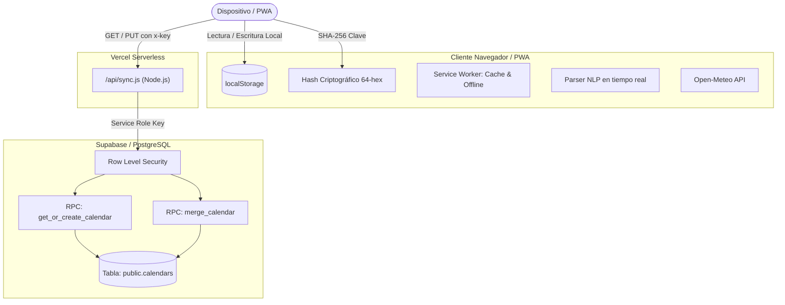

# 📅 Calendario 26/27 — Agenda Online & PWA

[](https://vercel.com)
[](https://supabase.com)
[](https://web.dev/progressive-web-apps/)
[](https://developer.mozilla.org/es/docs/Web/JavaScript)
[](LICENSE)

**Calendario 26/27** es una aplicación web progresiva (**PWA**) de gestión y planificación personal/académica diseñada específicamente para el curso **Septiembre 2026 – Agosto 2027**. 

Combina una experiencia visual cuidada al detalle (estética editorial, fondos fotográficos atmosféricos y microinteracciones) con una arquitectura **Local-First**, entrada de eventos mediante **procesamiento de lenguaje natural (NLP)** y **sincronización multi-dispositivo en tiempo real** respaldada por **Supabase** y **Vercel Serverless Functions**.

---

## 📑 Tabla de Contenidos

- [✨ Características Principales](#-características-principales)
- [🏗️ Arquitectura del Sistema](#️-arquitectura-del-sistema)
- [🔄 Cómo Funciona la Sincronización](#-cómo-funciona-la-sincronización)
- [🧠 Procesamiento de Lenguaje Natural (NLP)](#-procesamiento-de-lenguaje-natural-nlp)
- [🌦️ Integración Meteorológica](#️-integración-meteorológica)
- [📱 Instalación como App (PWA)](#-instalación-como-app-pwa)
- [📁 Estructura del Proyecto](#-estructura-del-proyecto)
- [🚀 Despliegue y Configuración](#-despliegue-y-configuración)
  - [1. Configuración de Base de Datos (Supabase)](#1-configuración-de-base-de-datos-supabase)
  - [2. Despliegue en Vercel](#2-despliegue-en-vercel)
  - [3. Variables de Entorno](#3-variables-de-entorno)
- [🔐 Seguridad y Privacidad](#-seguridad-y-privacidad)
- [🛠️ Stack Tecnológico](#️-stack-tecnológico)

---

## ✨ Características Principales

- **🎨 Diseño Editorial & UI Inmersiva**:
  - Tipografías prémium de Google Fonts (*Abril Fatface*, *Belleza*, *Allura* y *Montserrat*).
  - Fondos temáticos por mes con transiciones suaves en scroll (*parallax / opacity blending*).
  - Barra lateral (*rail*) con navegación rápida entre meses y selector dinámico de color.
  - Saludo interactivo según la hora del día con efecto de mecanografía (*typewriter*).
  - Anillo de progreso circular SVG que calcula el % de tareas completadas para la jornada actual.
  - Efecto de celebración con confeti en Canvas al marcar tareas como completadas.

- **⚡ Entrada Inteligente de Eventos (NLP)**:
  - Crea tareas escribiendo frases naturales como:
    > *"examen mates 15 oct 10h"* o *"entrega práctica viernes 18h"*
  - Extracción automática de fecha, hora, categoría y título con previsualización en tiempo real.

- **🏷️ Categorización Visual de Tareas**:
  - **Examen** (`#d8736a` / Terracota)
  - **Entrega** (`#b59a82` / Arena)
  - **Cumple** (`#e08aa5` / Rosa pastel)
  - **Tarea** (`#7d9168` / Verde salvia)
  - **Otro** (`#7b93b8` / Azul acero)

- **🌤️ Widget del Clima en Tiempo Real**:
  - Conexión a la API de **Open-Meteo** (sin consumo de cuotas de API keys).
  - Geoposición automática con fallback inteligente.
  - Modal desplegable con temperatura actual, mínimas/máximas, humedad, viento, probabilidad de precipitación y pronóstico extendido semanal con barras visuales térmicas.

- **🔄 Sincronización Segura sin Registro Tradicional**:
  - No requiere registrar correos ni contraseñas complejas.
  - Acceso mediante una **clave secreta**. Todos los dispositivos que compartan esa clave verán el mismo calendario unificado.
  - Derivación criptográfica local vía **SHA-256** antes del envío a la API.

- **📴 Arquitectura Local-First & PWA**:
  - Almacenamiento local instantáneo en `localStorage`.
  - Service Worker con estrategia de caché offline para funcionamiento garantizado sin conexión.
  - Instalable en pantalla de inicio en iOS, Android, macOS y Windows.

---

## 🏗️ Arquitectura del Sistema



---

## 🔄 Cómo Funciona la Sincronización

La aplicación utiliza un algoritmo determinista de **Resolución de Conflictos basada en Última Escritura (LWW - Last-Write-Wins)** a nivel de campo:

1. **Estructura de Datos**:
   - `S` (State): Mapa de clave-valor con los datos del evento en formato serializado.
   - `T` (Timestamps): Marcas de tiempo UNIX (`Date.now()`) que registran cuándo se creó o modificó cada entrada por última vez.
2. **Proceso de Fusión en la Base de Datos**:
   - Al emitir una petición `PUT` a `/api/sync`, la función RPC de PostgreSQL `merge_calendar` bloquea la fila del calendario (`FOR UPDATE`) para garantizar concurrencia atómica.
   - Se comparan las marcas de tiempo entrantes (`p_data->'T'`) contra las existentes (`v_existing->'T'`).
   - Solo los campos con una marca temporal estrictamente mayor (`rt > lt`) sobreescriben el estado actual. Si se elimina un evento, se borra de `S` y se conserva su timestamp más reciente para propagar la eliminación.
3. **Detección Automática y Segundo Plano**:
   - Monitoreo de foco y visibilidad (`visibilitychange`). Al regresar a la pestaña, se lanza automáticamente un `pull` de cambios.
   - Almacenamiento diferido con debounce de 900 ms para evitar saturar la base de datos mientras el usuario escribe o interactúa.

---

## 🧠 Procesamiento de Lenguaje Natural (NLP)

El analizador sintáctico en el cliente detecta de forma instantánea patrones en el texto introducido en el modal:

| Entrada de Ejemplo | Título Extraído | Fecha Asignada | Hora | Categoría |
| :--- | :--- | :--- | :--- | :--- |
| `examen mates 15 oct 10h` | Mates | 15 de Octubre 2026 | 10:00 | **Examen** |
| `entrega proyecto final viernes 18:30` | Proyecto final | Próximo viernes | 18:30 | **Entrega** |
| `cumple de Carlos pasado mañana` | De Carlos | Hoy + 2 días | — | **Cumple** |
| `comprar cuadernos hoy a las 17h` | Comprar cuadernos | Día de hoy | 17:00 | **Tarea** |

---

## 🌦️ Integración Meteorológica

El widget de la cabecera consulta directamente los datos de **Open-Meteo**:
- **Geolocalización**: Emplea la API estándar `navigator.geolocation` del navegador para obtener coordenadas locales exactas.
- **Respaldo Inteligente**: En caso de denegar permisos o carecer de soporte GPS, utiliza una ubicación predeterminada (Sevilla).
- **Caché Local**: Guarda las respuestas en `localStorage` con expiración para minimizar llamadas de red y optimizar la batería del dispositivo.

---

## 📱 Instalación como App (PWA)

Al cumplir con los estándares de Progressive Web App, **Calendario 26/27** puede instalarse sin pasar por App Store ni Google Play:

- **En iOS (Safari)**:
  1. Pulsa el botón **Compartir** (icono de cuadrado con flecha hacia arriba).
  2. Selecciona **Añadir a la pantalla de inicio**.
  3. Pulsa **Añadir**.
- **En Android (Chrome / Edge / Firefox)**:
  1. Pulsa el menú de tres puntos en la esquina superior derecha.
  2. Selecciona **Instalar aplicación** o **Añadir a la pantalla principal**.
- **En Escritorio (Chrome / Edge)**:
  1. Haz clic en el icono de instalación situado en la barra de direcciones del navegador.

---

## 📁 Estructura del Proyecto

```text
AgendaOnline/
├── api/
│   └── sync.js             # Función Serverless en Vercel (manejo de RPC Supabase, limpieza y auth)
├── assets/
│   ├── sep.jpg ... ago.jpg # Fondos fotográficos de alta resolución por cada mes
│   ├── flor.png            # Recurso decorativo
│   ├── icon-192.png        # Icono PWA (192x192)
│   └── icon-512.png        # Icono PWA (512x512 maskable)
├── supabase/
│   └── schema.sql          # DDL completo de PostgreSQL, tablas, RLS y funciones RPC atómicas
├── index.html              # Frontend SPA completo (HTML5 semántico, CSS3 moderno, lógica JS)
├── manifest.webmanifest    # Manifiesto de la Progressive Web App
├── sw.js                   # Service Worker para caché offline
└── README.md               # Documentación oficial del proyecto
```

---

## 🚀 Despliegue y Configuración

### 1. Configuración de Base de Datos (Supabase)

1. Crea un proyecto gratuito en [supabase.com](https://supabase.com).
2. En el panel lateral, dirígete a **SQL Editor** -> **New query**.
3. Copia y pega el contenido del archivo [`supabase/schema.sql`](file:///Users/usuario/Documents/WEBS/AgendaOnline/supabase/schema.sql) y haz clic en **Run**.
4. Este script configurará:
   - La tabla `public.calendars`.
   - Bloqueo de seguridad estricto con **Row Level Security (RLS)** sin políticas públicas.
   - Las funciones PL/pgSQL `get_or_create_calendar` y `merge_calendar`, autorizadas únicamente para el rol `service_role`.
5. Ve a **Project Settings** -> **API** y toma nota de:
   - **Project URL** (`https://xxxxxxxx.supabase.co`)
   - Clave privada **`service_role`** (*Secret* — nunca compartir ni incluir en el frontend).

### 2. Despliegue en Vercel

1. Vincula tu repositorio de GitHub con [Vercel](https://vercel.com/new).
2. Vercel detectará automáticamente la estructura estática junto con la carpeta de funciones `/api`.
3. Antes de desplegar, añade las variables de entorno detalladas a continuación.

### 3. Variables de Entorno

En tu panel de Vercel (**Settings** -> **Environment Variables**), añade las siguientes claves:

| Variable | Descripción | Ámbito |
| :--- | :--- | :--- |
| `SUPABASE_URL` | URL de tu proyecto Supabase (`https://<project-ref>.supabase.co`) | Producción / Preview |
| `SUPABASE_SERVICE_ROLE_KEY` | Clave secreta con rol `service_role` de Supabase | Producción / Preview |

> [!CAUTION]
> **Nunca** expongas `SUPABASE_SERVICE_ROLE_KEY` en el cliente (`index.html`). Solo debe residir en las variables de entorno de Vercel para ser consumida exclusivamente por la Serverless Function `/api/sync.js`.

---

## 🔐 Seguridad y Privacidad

- **Zero-Knowledge Hash en Frontend**: La clave introducida por el usuario nunca viaja en texto plano a la red; el cliente genera un digest SHA-256 (`cal2627|<clave>`), utilizándolo como identificador único (`x-key`).
- **Blindaje RLS**: Nadie puede consultar la base de datos de Supabase usando la clave anónima (`anon key`). Todas las mutaciones y consultas pasan obligatoriamente por el backend con validación de expresiones regulares de hash (`^[a-f0-9]{64}$`).
- **Protección contra DoS y Cargas Excesivas**: El endpoint valida el formato de clave, descarta campos maliciosos (`__proto__`), restringe el tamaño del payload a menos de 900 KB y aplica límites de caracteres en las notas.

---

## 🛠️ Stack Tecnológico

- **Frontend**: Vanilla JavaScript (ES6+), HTML5, CSS3 Glassmorphism, Canvas API.
- **PWA**: Service Workers API, Web App Manifest.
- **Backend / Serverless**: Node.js en Vercel Serverless Functions.
- **Base de Datos**: PostgreSQL en Supabase, PL/pgSQL, JSONB.
- **APIs Externas**: Open-Meteo Weather Forecast API.
- **Tipografía y Gráficos**: Google Fonts, SVG nativo.

---

## 📄 Licencia

Este proyecto se distribuye bajo los términos de la licencia [MIT](LICENSE). Puedes adaptarlo y utilizarlo libremente.
